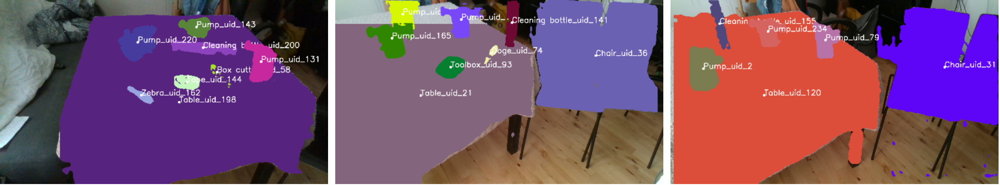
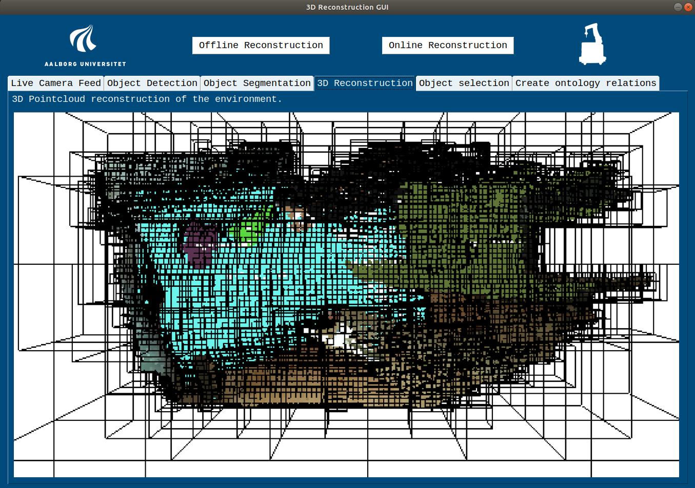
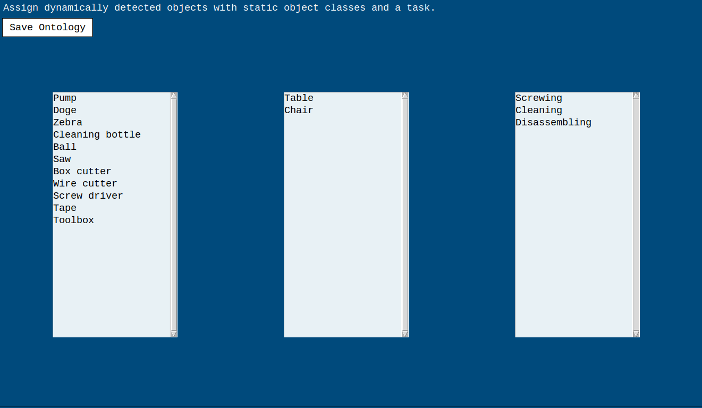
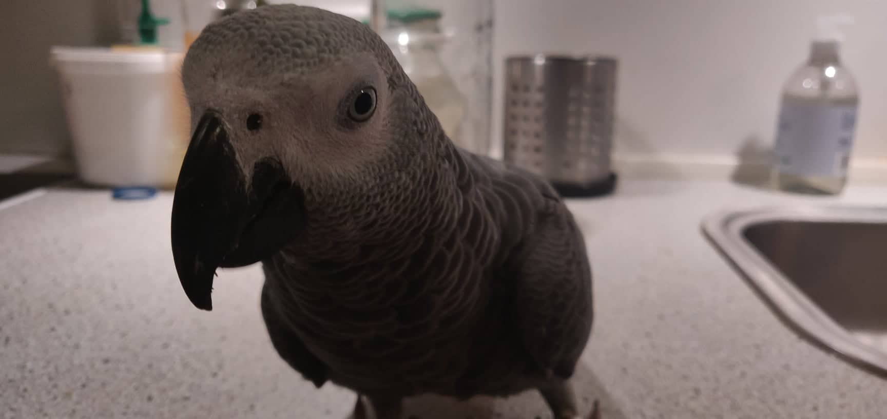

# 3D Volumetric and Semantic Environment Reconstruction

This repo contains the materials used in the Master's Thesis from Guilherme Mateus at Aalborg University. The pipeline contained in it creates 3D semantical and volumetric reconstructions of environments using Deep Learning. This implementation is done using ROS melodic as a framework of communication.



A small description of each package is given below:

  - **ontologies**: Handles object ontonlogies.
  - **service**: Consists of services files for system communication.
  - **realsense-ros**: Gathers data using realsense camera.
  - **userInterface**: Provides a GUI for users to control the system.
  - **vision**: Handles screw detection using YOLOv4 and DeepLabV3+.

## Getting Started

The system contains YOLOv4 and DeepLabV3+. However, YOLOv4 still has to be manually built under ```catkin_ws/src/release/vision/src/vision/pythonClasses/darknet.py```, for that follow the instructions on the [repo](https://github.com/AlexeyAB/darknet).

OBS: To build darknet you need to get a CMake version bigger than 3.12, which is not compatible with ROS. Do not uninstall the current version installed in the system, instead use a local CMake version.


In case of problems with DeepLabV3+, follow the [repo](https://github.com/jfzhang95/pytorch-deeplab-xception).

Pre-trained models and configs can be found by using ```./setup.sh```. The weights are stored under ```/opt/vision/```, therefore to use the weights models the script needs root permissions. Alternatively the weights paths must be manually changed in ```catkin_ws/src/release/vision/src/vision/pythonClasses/detectObjects.py``` and ```catkin_ws/src/release/vision/src/vision/pythonClasses/segmentationInit.py```.


If it still doesn't work, I don't know mate, ask my parrot, he might know it better than me or something like that.
### Prerequisites

This requires a system setup with ROS. It is recommended to use `Ubuntu 18.04` with `ROS Melodic`.

### Creating workspace and cloning the repository

```bash
# create a catkin workspace
mkdir -p catkin_ws/src && cd catkin_ws/src

# Clone the repository from bitbucket.
git clone --recursive https://guimateus@bitbucket.org/guimateus/thesis.git

# install dependencies
sudo apt update -qq && cd ..
rosdep update
rosdep install --from-paths . --ignore-src --rosdistro melodic -y

#install python catkin tools. Needed for catkin build command
sudo apt-get install python-catkin-tools

# build the workspace
catkin build
```

### Installing dependencies

Go to Intel Realsense website and [install the SDK for Linux](https://www.intelrealsense.com/developers/).


### Launching The System

To launch system type the following to a terminal window.

```shell
roslaunch launch_nodes main.launch
```

## Running reconstructions
This is the user interface of the system



First use offline reconstruction to detect static objects in the environment. Then, to perform an online reconstruction create ontological relations using the tab of the interface shown below, and select an object of interest under the "Object Selection" tab.



The results can be visualized in "Object Detection", "Object Segmentation", and "3D Reconstruction".

## Future works
Some possible future works to increase quality of the repo:

  - **Segmentation change**: The qualitative results of the segmentation network are not satisfying, therefore it must be changed.
  - **Simplifying setup**: Setup can be a bit convoluted, so maybe I can make it a bit easier.
  - **Improve ontologies framework**: Could be cool to have some extra functionalities in ontologies and maybe use a stochastic method.
  - **Improve addition of new objects**: Kind of hard to add custom objects to system right now, have to make the training framework easier.
  - **Parrots**: This git repo critically lacks parrots.



# Authors

* **[Guilherme Mateus Martins]** - [email](mailto:gmateu16@student.aau.dk)   - [Git Profile](https://bitbucket.org/%7Bba72de4e-9cb6-4e73-89db-24d4d8f12fe7%7D/) - [LinkedIn](https://www.linkedin.com/in/guilherme-mateus-346b58b5/)

# Acknowledgements

* Aalborg university
* Dimitris Chrysostomou
* Some other cool people
* My computer for being a real trooper and not dying after this repo made it crash several times